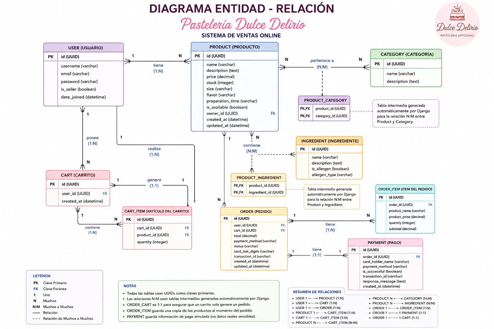

"# dulce_delirio" 
* Crear proyecto en django
django-admin startproject dulde_delirio
cd dulde_delirio
python manage.py startapp pasteleria

2 Configurar settings.py
 INSTALLED_APPS = [
     'pasteleria'
]
📌 Usuario personalizado
AUTH_USER_MODEL = 'pasteleria.User'

pasteleria/models.py
# pasteleria/models.py
import uuid
from django.db import models
from django.contrib.auth.models import AbstractUser
from django.core.validators import MinValueValidator, MaxValueValidator

# =========================
# 👤 Usuario
# =========================
class User(AbstractUser):
    id = models.UUIDField(primary_key=True, default=uuid.uuid4, editable=False)
    is_seller = models.BooleanField(default=False, verbose_name="¿Es vendedor?")

    def __str__(self):
        return self.username

# =========================
# 🏷️ Categoría
# =========================
class Category(models.Model):
    id = models.UUIDField(primary_key=True, default=uuid.uuid4, editable=False)
    name = models.CharField(max_length=100, verbose_name="Nombre")
    description = models.TextField(blank=True, verbose_name="Descripción")

    class Meta:
        verbose_name_plural = "Categorías"
        
    def __str__(self):
        return self.name

# =========================
# 🥚 Ingrediente
# =========================
class Ingredient(models.Model):
    """Ingredientes que pueden contener los productos de pastelería"""
    id = models.UUIDField(primary_key=True, default=uuid.uuid4, editable=False)
    name = models.CharField(max_length=150, verbose_name="Nombre del ingrediente")
    description = models.TextField(blank=True, verbose_name="Descripción")
    is_allergen = models.BooleanField(default=False, verbose_name="¿Es alérgeno común?")
    allergen_type = models.CharField(
        max_length=100, 
        blank=True, 
        verbose_name="Tipo de alérgeno",
        help_text="Ej: Gluten, Lácteos, Huevo, Frutos secos, etc."
    )
    
    class Meta:
        verbose_name_plural = "Ingredientes"
        ordering = ['name']
        
    def __str__(self):
        if self.is_allergen:
            return f"{self.name} ⚠️ ({self.allergen_type})"
        return self.name

# =========================
# 🧁 Producto (Pastel)
# =========================
class Product(models.Model):
    SIZE_CHOICES = [
        ('CH', 'Chico'),
        ('MD', 'Mediano'),
        ('GD', 'Grande'),
        ('XXL', 'Extragrande'),
    ]

    id = models.UUIDField(primary_key=True, default=uuid.uuid4, editable=False)
    name = models.CharField(max_length=150, verbose_name="Nombre del producto")
    description = models.TextField(verbose_name="Descripción")
    image = models.ImageField(upload_to='upload/', blank=True, null=True, verbose_name="Imagen")
    price = models.DecimalField(max_digits=10, decimal_places=2, verbose_name="Precio")
    stock = models.PositiveIntegerField(default=0, verbose_name="Existencia")
    
    # Campos de pastelería
    size = models.CharField(max_length=3, choices=SIZE_CHOICES, default='MD', verbose_name="Tamaño")
    flavor = models.CharField(max_length=100, verbose_name="Sabor")
    preparation_time = models.CharField(max_length=50, blank=True, verbose_name="Tiempo de preparación", help_text="Ej: 45 min, 2 horas")
    is_available = models.BooleanField(default=True, verbose_name="¿Disponible?")
    
    # Relación OneToMany: Un vendedor puede tener muchos productos
    owner = models.ForeignKey(
        User,
        on_delete=models.CASCADE,
        related_name='products',
        verbose_name="Vendedor"
    )

    # Relación ManyToMany: Un producto puede estar en muchas categorías
    categories = models.ManyToManyField(
        Category,
        related_name='products',
        verbose_name="Categorías"
    )
    
    # Relación ManyToMany: Un producto puede tener muchos ingredientes
    ingredients = models.ManyToManyField(
        Ingredient,
        related_name='products',
        verbose_name="Ingredientes",
        blank=True
    )

    created_at = models.DateTimeField(auto_now_add=True, verbose_name="Fecha de creación")
    updated_at = models.DateTimeField(auto_now=True, verbose_name="Última actualización")

    class Meta:
        verbose_name_plural = "Productos"
        ordering = ['-created_at']

    def __str__(self):
        return f"{self.name} ({self.get_size_display()}) - {self.flavor}"
    
    @property
    def average_rating(self):
        """Calcula el promedio de calificaciones del producto"""
        reviews = self.reviews.all()
        if reviews.exists():
            return round(reviews.aggregate(models.Avg('rating'))['rating__avg'], 1)
        return 0
    
    @property
    def allergens(self):
        """Devuelve lista de ingredientes que son alérgenos"""
        return self.ingredients.filter(is_allergen=True)
    
    @property
    def is_in_stock(self):
        """Verifica si hay stock disponible"""
        return self.stock > 0 and self.is_available

# =========================
# ⭐ Reseña/Valoración
# =========================
class Review(models.Model):
    """Reseñas y calificaciones de productos por parte de clientes"""
    id = models.UUIDField(primary_key=True, default=uuid.uuid4, editable=False)
    product = models.ForeignKey(
        Product, 
        on_delete=models.CASCADE, 
        related_name='reviews',
        verbose_name="Producto"
    )
    user = models.ForeignKey(
        User, 
        on_delete=models.CASCADE, 
        related_name='reviews',
        verbose_name="Cliente"
    )
    rating = models.PositiveSmallIntegerField(
        validators=[MinValueValidator(1), MaxValueValidator(5)],
        verbose_name="Calificación",
        help_text="Del 1 al 5"
    )
    comment = models.TextField(verbose_name="Comentario")
    created_at = models.DateTimeField(auto_now_add=True, verbose_name="Fecha de reseña")
    
    class Meta:
        verbose_name_plural = "Reseñas"
        ordering = ['-created_at']
        unique_together = ['product', 'user']
    
    def __str__(self):
        return f"{'⭐' * self.rating} - {self.user.username} sobre {self.product.name}"

# =========================
# 🛒 Carrito
# =========================
class Cart(models.Model):
    id = models.UUIDField(primary_key=True, default=uuid.uuid4, editable=False)
    user = models.ForeignKey(
        User,
        on_delete=models.CASCADE,
        related_name='carts',
        verbose_name="Usuario"
    )
    products = models.ManyToManyField(
        Product,
        through='CartItem',
        related_name='carts'
    )
    created_at = models.DateTimeField(auto_now_add=True, verbose_name="Fecha de creación")

    def __str__(self):
        return f"Carrito de {self.user.username}"

    @property
    def total(self):
        return sum(item.subtotal for item in self.cartitem_set.all())

# =========================
# 📦 CartItem
# =========================
class CartItem(models.Model):
    id = models.UUIDField(primary_key=True, default=uuid.uuid4, editable=False)
    cart = models.ForeignKey(Cart, on_delete=models.CASCADE, verbose_name="Carrito")
    product = models.ForeignKey(Product, on_delete=models.CASCADE, verbose_name="Producto")
    quantity = models.PositiveIntegerField(default=1, verbose_name="Cantidad")

    class Meta:
        unique_together = ('cart', 'product')
        verbose_name = "Artículo del carrito"
        verbose_name_plural = "Artículos del carrito"

    @property
    def subtotal(self):
        return self.product.price * self.quantity

    def __str__(self):
        return f"{self.quantity} x {self.product.name}"

# =========================
# 🧾 Pedido / Orden de Compra
# =========================
class Order(models.Model):
    PAYMENT_METHODS = [
        ('CARD', 'Tarjeta de crédito/débito'),
        ('PAYPAL', 'PayPal'),
        ('TRANSFER', 'Transferencia bancaria'),
        ('CASH', 'Efectivo (pago contra entrega)'),
    ]
    
    STATUS_CHOICES = [
        ('PENDING', 'Pendiente'),
        ('PAID', 'Pagado'),
        ('CANCELLED', 'Cancelado'),
        ('COMPLETED', 'Completado'),
    ]
    
    id = models.UUIDField(primary_key=True, default=uuid.uuid4, editable=False)
    user = models.ForeignKey(User, on_delete=models.CASCADE, related_name='orders', verbose_name="Cliente")
    cart = models.OneToOneField(Cart, on_delete=models.SET_NULL, null=True, blank=True, related_name='order', verbose_name="Carrito asociado")
    
    # Datos del pedido
    total = models.DecimalField(max_digits=10, decimal_places=2, verbose_name="Total")
    payment_method = models.CharField(max_length=20, choices=PAYMENT_METHODS, verbose_name="Método de pago")
    status = models.CharField(max_length=20, choices=STATUS_CHOICES, default='PENDING', verbose_name="Estado")
    
    # Datos de pago simulados (para historial)
    card_last_digits = models.CharField(max_length=4, blank=True, null=True, verbose_name="Últimos 4 dígitos")
    transaction_id = models.CharField(max_length=100, blank=True, null=True, verbose_name="ID de transacción")
    
    created_at = models.DateTimeField(auto_now_add=True, verbose_name="Fecha del pedido")
    updated_at = models.DateTimeField(auto_now=True, verbose_name="Última actualización")
    
    class Meta:
        verbose_name_plural = "Pedidos"
        ordering = ['-created_at']
    
    def __str__(self):
        return f"Pedido {self.id} - {self.user.username} - ${self.total}"
    
    @property
    def get_items(self):
        if self.cart:
            return self.cart.cartitem_set.all()
        return []

# =========================
# 📋 OrderItem (copia de seguridad)
# =========================
class OrderItem(models.Model):
    """Item dentro de un pedido (copia de seguridad)"""
    id = models.UUIDField(primary_key=True, default=uuid.uuid4, editable=False)
    order = models.ForeignKey(Order, on_delete=models.CASCADE, related_name='items', verbose_name="Pedido")
    product_name = models.CharField(max_length=200, verbose_name="Nombre del producto")
    product_price = models.DecimalField(max_digits=10, decimal_places=2, verbose_name="Precio")
    quantity = models.PositiveIntegerField(verbose_name="Cantidad")
    subtotal = models.DecimalField(max_digits=10, decimal_places=2, verbose_name="Subtotal")
    
    class Meta:
        verbose_name_plural = "Items del pedido"
    
    def __str__(self):
        return f"{self.quantity} x {self.product_name}"

# =========================
# 💳 Pago simulado
# =========================
class Payment(models.Model):
    """Registro de pago simulado"""
    id = models.UUIDField(primary_key=True, default=uuid.uuid4, editable=False)
    order = models.OneToOneField(Order, on_delete=models.CASCADE, related_name='payment', verbose_name="Pedido")
    
    # Datos ficticios (no se almacenan datos reales sensibles)
    card_holder_name = models.CharField(max_length=100, blank=True, null=True, verbose_name="Titular de la tarjeta")
    payment_method = models.CharField(max_length=20, choices=Order.PAYMENT_METHODS, verbose_name="Método de pago")
    
    # Simulación
    is_successful = models.BooleanField(default=True, verbose_name="¿Pago exitoso?")
    transaction_id = models.CharField(max_length=100, unique=True, verbose_name="ID de transacción")
    response_message = models.TextField(blank=True, verbose_name="Mensaje de respuesta")
    
    created_at = models.DateTimeField(auto_now_add=True, verbose_name="Fecha del pago")
    
    class Meta:
        verbose_name_plural = "Pagos"
    
    def __str__(self):
        return f"Pago {self.transaction_id} - ${self.order.total}"

4 Admin de django
pasteleria/admin.py

# pasteleria/admin.py
from django.contrib import admin
from .models import User, Category, Product, Cart, CartItem, Ingredient, Review

@admin.register(User)
class UserAdmin(admin.ModelAdmin):
    list_display = ('username', 'email', 'is_seller')
    list_filter = ('is_seller',)

@admin.register(Category)
class CategoryAdmin(admin.ModelAdmin):
    list_display = ('name',)

@admin.register(Ingredient)
class IngredientAdmin(admin.ModelAdmin):
    list_display = ('name', 'is_allergen', 'allergen_type')
    list_filter = ('is_allergen',)
    search_fields = ('name',)

class ReviewInline(admin.TabularInline):
    model = Review
    extra = 0
    readonly_fields = ('created_at',)

@admin.register(Product)
class ProductAdmin(admin.ModelAdmin):
    list_display = ('name', 'price', 'stock', 'size', 'flavor', 'is_available', 'owner')
    list_filter = ('categories', 'size', 'flavor', 'is_available')
    search_fields = ('name', 'flavor')
    filter_horizontal = ('ingredients',)  # Mejor interfaz para ManyToMany
    inlines = [ReviewInline]

class CartItemInline(admin.TabularInline):
    model = CartItem
    extra = 1

@admin.register(Cart)
class CartAdmin(admin.ModelAdmin):
    list_display = ('id', 'user', 'created_at')
    inlines = [CartItemInline]

@admin.register(Review)
class ReviewAdmin(admin.ModelAdmin):
    list_display = ('product', 'user', 'rating', 'created_at')
    list_filter = ('rating', 'created_at')
    search_fields = ('product__name', 'user__username', 'comment')

5 migraciones

python manage.py makemigrations
python manage.py migrate

6 crear supero usuario

python manage.py createsuperuser

7 ejecuta servidor

python manage.py runserver

ir a 
http://127.0.0.1:8000/admin/

🚀 SPRINT 2 — Autenticación + UI Base

URLs del proyecto 📁 config/urls.py

from django.contrib import admin
from django.conf import settings
from django.conf.urls.static import static
from django.urls import path, include

urlpatterns = [
    path('admin/', admin.site.urls),
    path('', include('pasteleria.urls')),
] + static(settings.MEDIA_URL, document_root=settings.MEDIA_ROOT)

URLs de la app 📁 crea el archivo urls.py en pasteleria/urls.py y agrega lo siguiente:
# Pasteleria/urls.py
from django.urls import path
from . import views

urlpatterns = [
    path('', views.home, name='home'),
    path('register/', views.register, name='register'),
    path('login/', views.login_view, name='login'),
    path('logout/', views.logout_view, name='logout'),

    # Dashboard
    path('dashboard/', views.dashboard, name='dashboard'),

    # Productos CRUD
    path('products/create/', views.product_create, name='product_create'),
    path('products/<uuid:pk>/edit/', views.product_update, name='product_update'),
    path('products/<uuid:pk>/delete/', views.product_delete, name='product_delete'),
    path('products/<uuid:pk>/', views.product_detail, name='product_detail'),

    # Cart
    path('cart/', views.cart_detail, name='cart_detail'),
    path('cart/add/<uuid:product_id>/', views.add_to_cart, name='add_to_cart'),
    path('cart/remove/<uuid:item_id>/', views.remove_from_cart, name='remove_from_cart'),
    path('cart/update/<uuid:item_id>/', views.update_cart_item, name='update_cart_item'),

    # Checkout y pagos
    path('checkout/', views.checkout, name='checkout'),
    path('order/<uuid:order_id>/', views.order_confirmation, name='order_confirmation'),
    path('my-orders/', views.my_orders, name='my_orders'),

]

Formularios 📁 creamos el archivo forms.py en pasteleria/forms.py:

from django import forms
from django.contrib.auth.forms import UserCreationForm
from .models import User, Product, Review, Order

class RegisterForm(UserCreationForm):
    email = forms.EmailField(required=True, label="Correo electrónico")
    is_seller = forms.BooleanField(required=False, label="Registrarse como vendedor")

    class Meta:
        model = User
        fields = ('username', 'email', 'is_seller', 'password1', 'password2')
        labels = {
            'username': 'Nombre de usuario',
        }

class ProductForm(forms.ModelForm):
    class Meta:
        model = Product
        fields = [
            'name', 'description', 'image', 'price', 'stock', 
            'size', 'flavor', 'preparation_time', 'is_available',
            'categories', 'ingredients'
        ]
        widgets = {
            'description': forms.Textarea(attrs={'rows': 4}),
            'categories': forms.CheckboxSelectMultiple(),
            'ingredients': forms.CheckboxSelectMultiple(),  # Selector múltiple para ingredientes
        }
        labels = {
            'name': 'Nombre del Pastel',
            'description': 'Descripción',
            'image': 'Fotografía',
            'price': 'Precio (MXN)',
            'stock': 'Existencia',
            'size': 'Tamaño',
            'flavor': 'Sabor',
            'preparation_time': 'Tiempo de preparación',
            'is_available': '¿Producto disponible?',
            'categories': 'Categorías',
            'ingredients': 'Ingredientes',
        }

class ReviewForm(forms.ModelForm):
    """Formulario para crear reseñas"""
    class Meta:
        model = Review
        fields = ['rating', 'comment']
        widgets = {
            'rating': forms.Select(choices=[
                (1, '⭐ - Malo'),
                (2, '⭐⭐ - Regular'),
                (3, '⭐⭐⭐ - Bueno'),
                (4, '⭐⭐⭐⭐ - Muy bueno'),
                (5, '⭐⭐⭐⭐⭐ - Excelente'),
            ]),
            'comment': forms.Textarea(attrs={
                'rows': 4, 
                'placeholder': 'Cuéntanos tu experiencia con este producto...'
            }),
        }
        labels = {
            'rating': 'Tu calificación',
            'comment': 'Tu comentario',
        }
# =========================
# Formulario de Pago (NUEVO)
# =========================
class PaymentForm(forms.Form):
    payment_method = forms.ChoiceField(
        choices=Order.PAYMENT_METHODS,
        widget=forms.Select(attrs={'class': 'form-select'}),
        label="Método de pago"
    )
    
    # Campos para tarjeta (solo se muestran condicionalmente)
    card_holder_name = forms.CharField(
        max_length=100,
        required=False,
        widget=forms.TextInput(attrs={'class': 'form-control', 'placeholder': 'Como aparece en la tarjeta'}),
        label="Nombre del titular"
    )
    card_number = forms.CharField(
        max_length=19,
        required=False,
        widget=forms.TextInput(attrs={'class': 'form-control', 'placeholder': '1234 5678 9012 3456'}),
        label="Número de tarjeta"
    )
    card_expiry = forms.CharField(
        max_length=5,
        required=False,
        widget=forms.TextInput(attrs={'class': 'form-control', 'placeholder': 'MM/AA'}),
        label="Fecha de expiración"
    )
    card_cvv = forms.CharField(
        max_length=4,
        required=False,
        widget=forms.TextInput(attrs={'class': 'form-control', 'placeholder': '123'}),
        label="CVV"
    )
    
    def clean(self):
        cleaned_data = super().clean()
        payment_method = cleaned_data.get('payment_method')
        
        if payment_method == 'CARD':
            required_fields = ['card_holder_name', 'card_number', 'card_expiry', 'card_cvv']
            for field in required_fields:
                if not cleaned_data.get(field):
                    self.add_error(field, 'Este campo es obligatorio para pagos con tarjeta.')
        
        # Validación simple de tarjeta (solo formato)
        if payment_method == 'CARD' and cleaned_data.get('card_number'):
            import re
            card_num = re.sub(r'\D', '', cleaned_data['card_number'])
            if len(card_num) < 13 or len(card_num) > 19:
                self.add_error('card_number', 'Número de tarjeta inválido (debe tener entre 13 y 19 dígitos).')
        
        return cleaned_data

Vistas 📁 pasteleria/views.py:

# pasteleria/views.py
from django.shortcuts import render, redirect, get_object_or_404
from django.contrib.auth import login, authenticate, logout
from django.contrib.auth.decorators import login_required
from django.contrib import messages
from django.core.paginator import Paginator
from django.db.models import Q, Avg
from django.http import HttpResponseForbidden
from .forms import ProductForm, RegisterForm, ReviewForm, PaymentForm
from .models import Product, Cart, CartItem, Category, Ingredient, Review, Order, OrderItem, Payment
import uuid

def home(request):
    """Vista principal con buscador, filtros y paginación."""
    query = request.GET.get('q')
    category_id = request.GET.get('category')
    size_filter = request.GET.get('size')
    flavor_query = request.GET.get('flavor')
    ingredient_filter = request.GET.get('ingredient')

    products = Product.objects.select_related('owner').prefetch_related(
        'categories', 'ingredients', 'reviews'
    ).filter(is_available=True)

    # Búsqueda por nombre o descripción
    if query:
        products = products.filter(
            Q(name__icontains=query) |
            Q(description__icontains=query) |
            Q(flavor__icontains=query)
        )

    # Filtro por categoría
    if category_id:
        products = products.filter(categories__id=category_id)

    # Filtro por tamaño
    if size_filter:
        products = products.filter(size=size_filter)

    # Filtro por sabor
    if flavor_query:
        products = products.filter(flavor__icontains=flavor_query)

    # Filtro por ingrediente
    if ingredient_filter:
        products = products.filter(ingredients__id=ingredient_filter)

    # Paginación: 6 productos por página
    paginator = Paginator(products, 6)
    page_number = request.GET.get('page')
    page_obj = paginator.get_page(page_number)

    categories = Category.objects.all()
    size_choices = Product.SIZE_CHOICES
    ingredients = Ingredient.objects.all().order_by('name')

    context = {
        'page_obj': page_obj,
        'categories': categories,
        'size_choices': size_choices,
        'ingredients': ingredients,
    }
    return render(request, 'pasteleria/home.html', context)

def register(request):
    """Registro de nuevos usuarios."""
    if request.method == 'POST':
        form = RegisterForm(request.POST)
        if form.is_valid():
            user = form.save()
            login(request, user)
            messages.success(request, '¡Cuenta creada exitosamente! Bienvenido/a.')
            return redirect('home')
    else:
        form = RegisterForm()
    return render(request, 'pasteleria/register.html', {'form': form})

def login_view(request):
    """Inicio de sesión."""
    if request.method == 'POST':
        username = request.POST.get('username')
        password = request.POST.get('password')
        user = authenticate(request, username=username, password=password)
        if user:
            login(request, user)
            messages.success(request, f'¡Bienvenido/a de nuevo, {user.username}!')
            return redirect('dashboard' if user.is_seller else 'home')
        else:
            messages.error(request, 'Usuario o contraseña incorrectos.')
    return render(request, 'pasteleria/login.html')

def logout_view(request):
    """Cierre de sesión."""
    logout(request)
    messages.info(request, 'Has cerrado sesión.')
    return redirect('home')

# =========================
# 📊 Dashboard (Solo Vendedores)
# =========================
@login_required
def dashboard(request):
    """Panel de control para administradores/vendedores."""
    if not request.user.is_seller:
        return HttpResponseForbidden("No tienes permisos para acceder a esta página.")

    products = Product.objects.filter(owner=request.user).prefetch_related('reviews', 'ingredients')
    total_products = products.count()
    total_reviews = Review.objects.filter(product__owner=request.user).count()
    avg_rating = Review.objects.filter(product__owner=request.user).aggregate(
        avg=Avg('rating')
    )['avg'] or 0

    context = {
        'products': products,
        'total_products': total_products,
        'total_reviews': total_reviews,
        'avg_rating': round(avg_rating, 1),
    }
    return render(request, 'pasteleria/dashboard.html', context)

# =========================
# 📝 CRUD de Productos
# =========================
@login_required
def product_create(request):
    """Crear un nuevo producto."""
    if not request.user.is_seller:
        return HttpResponseForbidden("Solo los vendedores pueden crear productos.")

    form = ProductForm(request.POST or None, request.FILES or None)
    if form.is_valid():
        product = form.save(commit=False)
        product.owner = request.user
        product.save()
        form.save_m2m()
        messages.success(request, f'¡{product.name} creado exitosamente!')
        return redirect('dashboard')
    return render(request, 'pasteleria/product_form.html', {'form': form, 'action': 'Crear'})

@login_required
def product_update(request, pk):
    """Editar un producto existente."""
    product = get_object_or_404(Product, pk=pk)
    if product.owner != request.user:
        return HttpResponseForbidden("No puedes editar este producto.")

    form = ProductForm(request.POST or None, request.FILES or None, instance=product)
    if form.is_valid():
        form.save()
        messages.success(request, f'¡{product.name} actualizado exitosamente!')
        return redirect('dashboard')
    return render(request, 'pasteleria/product_form.html', {'form': form, 'action': 'Editar'})

@login_required
def product_delete(request, pk):
    """Eliminar un producto."""
    product = get_object_or_404(Product, pk=pk)
    if product.owner != request.user:
        return HttpResponseForbidden("No puedes eliminar este producto.")

    if request.method == 'POST':
        product_name = product.name
        product.delete()
        messages.success(request, f'{product_name} ha sido eliminado.')
        return redirect('dashboard')
    return render(request, 'pasteleria/product_confirm_delete.html', {'product': product})

def product_detail(request, pk):
    """Ver el detalle de un producto con reseñas."""
    product = get_object_or_404(
        Product.objects.prefetch_related('ingredients', 'reviews__user'),
        pk=pk
    )
    reviews = product.reviews.all()
    user_review = None

    # Si el usuario está autenticado y ya dejó una reseña, se la mostramos
    if request.user.is_authenticated:
        user_review = reviews.filter(user=request.user).first()

    # Formulario para nueva reseña (solo si no ha dejado una)
    review_form = None
    if request.user.is_authenticated and not user_review:
        if request.method == 'POST':
            review_form = ReviewForm(request.POST)
            if review_form.is_valid():
                review = review_form.save(commit=False)
                review.product = product
                review.user = request.user
                review.save()
                messages.success(request, '¡Gracias por tu reseña!')
                return redirect('product_detail', pk=product.id)
        else:
            review_form = ReviewForm()

    # Productos relacionados (misma categoría)
    related_products = Product.objects.filter(
        categories__in=product.categories.all()
    ).exclude(id=product.id).distinct()[:4]

    context = {
        'product': product,
        'reviews': reviews,
        'user_review': user_review,
        'review_form': review_form,
        'related_products': related_products,
    }
    return render(request, 'pasteleria/product_detail.html', context)

# =========================
# 🛒 Carrito de Compras
# =========================
@login_required
def cart_detail(request):
    """Ver el contenido del carrito."""
    cart, created = Cart.objects.get_or_create(user=request.user)
    return render(request, 'pasteleria/cart_detail.html', {'cart': cart})

@login_required
def add_to_cart(request, product_id):
    """Añadir un producto al carrito."""
    cart, created = Cart.objects.get_or_create(user=request.user)
    product = get_object_or_404(Product, id=product_id)

    if not product.is_in_stock:
        messages.error(request, f'"{product.name}" no está disponible en este momento.')
        return redirect('product_detail', pk=product_id)

    cart_item, created = CartItem.objects.get_or_create(cart=cart, product=product)
    if not created:
        if cart_item.quantity < product.stock:
            cart_item.quantity += 1
            cart_item.save()
            messages.success(request, f'Se agregó otra unidad de "{product.name}" al carrito.')
        else:
            messages.warning(request, 'No hay suficiente stock disponible.')
    else:
        messages.success(request, f'"{product.name}" agregado al carrito.')

    return redirect('cart_detail')

@login_required
def remove_from_cart(request, item_id):
    """Eliminar un artículo del carrito."""
    item = get_object_or_404(CartItem, id=item_id, cart__user=request.user)
    product_name = item.product.name
    item.delete()
    messages.success(request, f'"{product_name}" eliminado del carrito.')
    return redirect('cart_detail')

@login_required
def update_cart_item(request, item_id):
    """Actualizar la cantidad de un artículo en el carrito."""
    item = get_object_or_404(CartItem, id=item_id, cart__user=request.user)

    if request.method == 'POST':
        quantity = int(request.POST.get('quantity', 1))
        if quantity > item.product.stock:
            messages.warning(request, f'Solo hay {item.product.stock} unidades disponibles de "{item.product.name}".')
            quantity = item.product.stock

        if quantity > 0:
            item.quantity = quantity
            item.save()
            messages.success(request, 'Cantidad actualizada.')
        else:
            item.delete()
            messages.success(request, 'Producto eliminado del carrito.')

    return redirect('cart_detail')

# =========================
# 💳 Sistema de Pagos (NUEVO)
# =========================
@login_required
def checkout(request):
    """Vista de checkout y selección de método de pago"""
    cart, created = Cart.objects.get_or_create(user=request.user)
    
    # Verificar que el carrito no esté vacío
    if not cart.cartitem_set.exists():
        messages.warning(request, "Tu carrito está vacío. Agrega productos antes de proceder al pago.")
        return redirect('cart_detail')
    
    # Verificar stock disponible antes de procesar
    for item in cart.cartitem_set.all():
        if item.quantity > item.product.stock:
            messages.error(request, f'No hay suficiente stock de "{item.product.name}". Disponible: {item.product.stock}')
            return redirect('cart_detail')
    
    if request.method == 'POST':
        form = PaymentForm(request.POST)
        if form.is_valid():
            payment_method = form.cleaned_data['payment_method']
            total = cart.total
            
            # Crear el pedido SIN asignar el carrito para evitar UNIQUE constraint
            order = Order.objects.create(
                user=request.user,
                cart=None,  # No asignamos carrito para evitar duplicados
                total=total,
                payment_method=payment_method,
                status='PAID',
                transaction_id=f"TXN-{uuid.uuid4().hex[:10].upper()}"
            )
            
            # Guardar items del pedido como copia de seguridad
            for item in cart.cartitem_set.all():
                OrderItem.objects.create(
                    order=order,
                    product_name=item.product.name,
                    product_price=item.product.price,
                    quantity=item.quantity,
                    subtotal=item.subtotal
                )
            
            # Datos para el registro de pago
            card_holder = form.cleaned_data.get('card_holder_name') if payment_method == 'CARD' else None
            card_number_raw = form.cleaned_data.get('card_number', '')
            card_last_digits = card_number_raw[-4:] if len(card_number_raw) >= 4 and payment_method == 'CARD' else None
            
            # Guardar últimos dígitos en el pedido
            if card_last_digits:
                order.card_last_digits = card_last_digits
                order.save()
            
            # Crear registro de pago
            Payment.objects.create(
                order=order,
                card_holder_name=card_holder,
                payment_method=payment_method,
                is_successful=True,
                transaction_id=order.transaction_id,
                response_message="Pago simulado exitoso"
            )
            
            # DESCONTAR STOCK
            for item in cart.cartitem_set.all():
                product = item.product
                product.stock -= item.quantity
                product.save()
            
            # VACIAR CARRITO
            cart.cartitem_set.all().delete()
            
            messages.success(request, f"¡Compra realizada con éxito! Tu pedido #{order.id} ha sido confirmado.")
            return redirect('order_confirmation', order_id=order.id)
        else:
            messages.error(request, 'Por favor, completa correctamente los datos de pago.')
    else:
        form = PaymentForm(initial={'payment_method': 'CARD'})
    
    return render(request, 'pasteleria/checkout.html', {
        'cart': cart,
        'form': form
    })

@login_required
def order_confirmation(request, order_id):
    """Vista de confirmación de pedido"""
    order = get_object_or_404(Order, id=order_id, user=request.user)
    payment = order.payment if hasattr(order, 'payment') else None
    
    return render(request, 'pasteleria/order_confirmation.html', {
        'order': order,
        'payment': payment
    })

@login_required
def my_orders(request):
    """Lista de pedidos del usuario"""
    orders = Order.objects.filter(user=request.user).order_by('-created_at')
    return render(request, 'pasteleria/my_orders.html', {
        'orders': orders
    })

    Templates (Bootstrap 5.3) 📁 Creamos la carpeta templates y dentro la carpeta pasteleria agregamos los siguientes archivos de la Estructura:

    templates/
 └── store/
     ├── base.html
     ├── cart_deatil.html
     ├── checkout.html
     └── dashboard.html
     └── home.html
     └── login.html
     └── order_confirmation.html
     └── product_confirm.html
     └── product_detail.html
     └── product_form.html
     

     🧩 base.html
  <!DOCTYPE html>
<html lang="es">
<head>
    <meta charset="UTF-8">
    <meta name="viewport" content="width=device-width, initial-scale=1.0">
    <title>Pastelería Dulce Delirio</title>
    <link href="https://cdn.jsdelivr.net/npm/bootstrap@5.3.0/dist/css/bootstrap.min.css" rel="stylesheet">
    <link rel="stylesheet" href="https://cdn.jsdelivr.net/npm/bootstrap-icons@1.10.0/font/bootstrap-icons.css">
    
    
</head>
<body>
    <nav class="navbar navbar-expand-lg navbar-light bg-light shadow-sm sticky-top">
        

            <a class="navbar-brand" href="">
                <i class="bi bi-cake2-fill"></i> Dulce Delirio
            </a>
            <button class="navbar-toggler" type="button" data-bs-toggle="collapse" data-bs-target="#navbarContent">
                
            </button>
            

                <ul class="navbar-nav ms-auto mb-2 mb-lg-0 align-items-center">
                    
                        <li class="nav-item">
                            <a href="" class="btn btn-outline-secondary btn-sm me-2 position-relative">
                                <i class="bi bi-cart3"></i> Carrito
                            </a>
                        </li>
                        
                        <li class="nav-item">
                            <a href="" class="btn btn-outline-warning btn-sm me-2">Dashboard</a>
                        </li>
                        
                        <li class="nav-item">
                            Hola, {{ user.username }}!
                        </li>
                        <li class="nav-item">
                            <a href="" class="btn btn-outline-danger btn-sm">Salir</a>
                        </li>
                    
                        <li class="nav-item">
                            <a href="" class="btn btn-outline-secondary btn-sm me-2">Ingresar</a>
                        </li>
                        <li class="nav-item">
                            <a href="" class="btn btn-pastel btn-sm">Registrarse</a>
                        </li>
                    
                </ul>
            

        

    </nav>

    <main class="container py-4">
        
            
                

                    {{ message }}
                    <button type="button" class="btn-close" data-bs-dismiss="alert" aria-label="Close"></button>
                

            
        

        
    </main>

    <footer class="bg-light text-center text-muted py-4 mt-5 border-top">
        

            
© 2026 Pastelería Dulce Delirio. Hecho con <i class="bi bi-heart-fill text-danger"></i> y Django.

        

    </footer>

    
    
</body>
</html>

cart_detail.html


Mi Carrito - Pastelería


<h2 class="mb-4"><i class="bi bi-cart3"></i> Mi Carrito</h2>



    <table class="table table-hover align-middle">
        <thead class="table-light">
            <tr>
                <th>Producto</th>
                <th>Precio</th>
                <th>Cantidad</th>
                <th>Subtotal</th>
                <th></th>
            </tr>
        </thead>
        <tbody>
            
            <tr>
                <td class="align-middle">
                    

                        
                            
                        
                        

                            <strong>{{ item.product.name }}</strong> 
                            <small class="text-muted">{{ item.product.flavor }} | {{ item.product.get_size_display }}</small>
                        

                    

                </td>
                <td class="align-middle">${{ item.product.price }}</td>
                <td class="align-middle">
                    <form method="POST" action="" class="input-group input-group-sm" style="width: 130px;">
                        
                        <input type="number" name="quantity" value="{{ item.quantity }}" min="1" class="form-control text-center">
                        <button class="btn btn-outline-secondary" type="submit"><i class="bi bi-arrow-clockwise"></i></button>
                    </form>
                </td>
                <td class="align-middle fw-bold">${{ item.subtotal }}</td>
                <td class="align-middle">
                    <a href="" class="btn btn-outline-danger btn-sm">
                        <i class="bi bi-trash3"></i>
                    </a>
                </td>
            </tr>
            
        </tbody>
        <tfoot class="table-group-divider">
            <tr>
                <td colspan="3" class="text-end fw-bold fs-5">Total:</td>
                <td colspan="2" class="fw-bold fs-5 text-success">${{ cart.total }}</td>
            </tr>
        </tfoot>
    </table>

    <a href="" class="btn btn-outline-secondary me-2">
        <i class="bi bi-arrow-left"></i> Seguir Comprando
    </a>
    <a href="" class="btn btn-pastel btn-lg">
        <i class="bi bi-credit-card"></i> Proceder al Pago
    </a>



    <i class="bi bi-cart-x fs-1 d-block mb-3"></i>
    Tu carrito está vacío. 
    <a href="" class="alert-link">¡Ve a comprar algo dulce!</a>




checkout.html


Mi Carrito - Pastelería


<h2 class="mb-4"><i class="bi bi-cart3"></i> Mi Carrito</h2>



    <table class="table table-hover align-middle">
        <thead class="table-light">
            <tr>
                <th>Producto</th>
                <th>Precio</th>
                <th>Cantidad</th>
                <th>Subtotal</th>
                <th></th>
            </tr>
        </thead>
        <tbody>
            
            <tr>
                <td class="align-middle">
                    

                        
                            
                        
                        

                            <strong>{{ item.product.name }}</strong> 
                            <small class="text-muted">{{ item.product.flavor }} | {{ item.product.get_size_display }}</small>
                        

                    

                </td>
                <td class="align-middle">${{ item.product.price }}</td>
                <td class="align-middle">
                    <form method="POST" action="" class="input-group input-group-sm" style="width: 130px;">
                        
                        <input type="number" name="quantity" value="{{ item.quantity }}" min="1" class="form-control text-center">
                        <button class="btn btn-outline-secondary" type="submit"><i class="bi bi-arrow-clockwise"></i></button>
                    </form>
                </td>
                <td class="align-middle fw-bold">${{ item.subtotal }}</td>
                <td class="align-middle">
                    <a href="" class="btn btn-outline-danger btn-sm">
                        <i class="bi bi-trash3"></i>
                    </a>
                </td>
            </tr>
            
        </tbody>
        <tfoot class="table-group-divider">
            <tr>
                <td colspan="3" class="text-end fw-bold fs-5">Total:</td>
                <td colspan="2" class="fw-bold fs-5 text-success">${{ cart.total }}</td>
            </tr>
        </tfoot>
    </table>

    <a href="" class="btn btn-outline-secondary me-2">
        <i class="bi bi-arrow-left"></i> Seguir Comprando
    </a>
    <a href="" class="btn btn-pastel btn-lg">
        <i class="bi bi-credit-card"></i> Proceder al Pago
    </a>



    <i class="bi bi-cart-x fs-1 d-block mb-3"></i>
    Tu carrito está vacío. 
    <a href="" class="alert-link">¡Ve a comprar algo dulce!</a>




dashboard.html


Dashboard - Pastelería


<!-- Estadísticas -->

    

        

            

                

                    

                        <h6 class="card-title">Total Productos</h6>
                        <h2>{{ total_products }}</h2>
                    

                    <i class="bi bi-box-seam fs-1"></i>
                

            

        

    

    

        

            

                

                    

                        <h6 class="card-title">Total Reseñas</h6>
                        <h2>{{ total_reviews }}</h2>
                    

                    <i class="bi bi-star-fill fs-1"></i>
                

            

        

    

    

        

            

                

                    

                        <h6 class="card-title">Calificación Promedio</h6>
                        <h2>{{ avg_rating }} ⭐</h2>
                    

                    <i class="bi bi-graph-up fs-1"></i>
                

            

        

    

    <h2><i class="bi bi-speedometer2"></i> Mis Productos</h2>
    <a href="" class="btn btn-pastel">
        <i class="bi bi-plus-circle"></i> Nuevo Pastel
    </a>

    

        

            <table class="table table-hover align-middle mb-0">
                <thead class="table-light">
                    <tr>
                        <th style="width: 80px;">Imagen</th>
                        <th>Nombre</th>
                        <th>Sabor</th>
                        <th>Tamaño</th>
                        <th>Ingredientes</th>
                        <th>Precio</th>
                        <th>Stock</th>
                        <th>Reseñas</th>
                        <th class="text-center">Acciones</th>
                    </tr>
                </thead>
                <tbody>
                
                    <tr>
                        <td>
                            
                                
                            
                                

                                    <small>N/A</small>
                                

                            
                        </td>
                        <td class="fw-bold">{{ product.name }}</td>
                        <td>{{ product.flavor }}</td>
                        <td>{{ product.get_size_display }}</td>
                        <td>
                            <small class="text-muted">{{ product.ingredients.count }} ingredientes</small>
                        </td>
                        <td>${{ product.price }}</td>
                        <td>
                            
                                {{ product.stock }} u.
                            
                        </td>
                        <td>
                            
                                {{ product.average_rating }} ⭐
                            
                             
                            <small class="text-muted">({{ product.reviews.count }})</small>
                        </td>
                        <td class="text-center">
                            <a href="" class="btn btn-outline-info btn-sm" title="Ver">
                                <i class="bi bi-eye"></i>
                            </a>
                            <a href="" class="btn btn-outline-warning btn-sm" title="Editar">
                                <i class="bi bi-pencil-square"></i>
                            </a>
                            <a href="" class="btn btn-outline-danger btn-sm" title="Eliminar">
                                <i class="bi bi-trash3"></i>
                            </a>
                        </td>
                    </tr>
                
                    <tr>
                        <td colspan="9" class="text-center py-4 text-muted">
                            <i class="bi bi-cup-hot fs-1 d-block"></i>
                            Aún no has creado ningún pastel. 
                            <a href="" class="btn btn-pastel btn-sm mt-2">Crear mi primer pastel</a>
                        </td>
                    </tr>
                
                </tbody>
            </table>
        

    



home.html




Inicio - Pastelería Dulce Delirio



    <!-- Título -->
    

        <h1 class="fw-bold">Pastelería Dulce Delirio</h1>
        

           "Dulzura"
        

    

    <!-- Filtros -->
    

        

            

                
                

                    <h5 class="mb-0">
                        Buscar Pasteles
                    </h5>
                

                

                    <form method="GET" class="row g-3">

                        <!-- Buscar -->
                        

                            <label class="form-label">Buscar</label>

                            <input
                                type="text"
                                name="q"
                                class="form-control"
                                placeholder="Nombre del pastel..."
                                value="{{ request.GET.q }}"
                            >
                        

                        <!-- Categoría -->
                        

                            <label class="form-label">Categoría</label>

                            <select name="category" class="form-select">

                                <option value="">Todas</option>

                                
                                    <option
                                        value="{{ category.id }}"
                                        
                                            selected
                                        
                                    >
                                        {{ category.name }}
                                    </option>
                                

                            </select>
                        

                        <!-- Tamaño -->
                        

                            <label class="form-label">Tamaño</label>

                            <select name="size" class="form-select">

                                <option value="">Todos</option>

                                
                                    <option
                                        value="{{ key }}"
                                        
                                            selected
                                        
                                    >
                                        {{ value }}
                                    </option>
                                

                            </select>
                        

                        <!-- Sabor -->
                        

                            <label class="form-label">Sabor</label>

                            <input
                                type="text"
                                name="flavor"
                                class="form-control"
                                placeholder="Chocolate..."
                                value="{{ request.GET.flavor }}"
                            >
                        

                        <!-- Ingrediente -->
                        

                            <label class="form-label">Ingrediente</label>

                            <select name="ingredient" class="form-select">

                                <option value="">Todos</option>

                                
                                    <option
                                        value="{{ ingredient.id }}"
                                        
                                            selected
                                        
                                    >
                                        {{ ingredient.name }}
                                    </option>
                                

                            </select>
                        

                        <!-- Botón -->
                        

                            <label class="form-label">&nbsp;</label>

                            <button class="btn btn-dark">
                                Buscar
                            </button>
                        

                    </form>

                

            

        

    

    <!-- Productos -->
    

        

        

            

                <!-- Imagen -->
                
                    
                
                    

                        Sin imagen
                    

                

                <!-- Body -->
                

                    <!-- Categorías -->
                    

                        
                            
                                {{ cat.name }}
                            
                        
                    

                    <!-- Nombre -->
                    <h5 class="card-title">
                        {{ product.name }}
                    </h5>

                    <!-- Descripción -->
                    

                        {{ product.description|truncatechars:80 }}
                    

                    <!-- Tamaño y sabor -->
                    

                        
                            {{ product.get_size_display }}
                        

                        
                            {{ product.flavor }}
                        

                    

                    <!-- Ingredientes -->
                    

                    

                        <small class="text-muted">
                            Ingredientes:
                        </small>

                         

                        
                            
                                {{ ingredient.name }}
                            
                        

                    

                    

                    <!-- Precio -->
                    

                        
                            ${{ product.price }}
                        

                        <small class="text-muted">
                            Stock: {{ product.stock }}
                        </small>

                    

                

                <!-- Footer -->
                

                    

                        <a
                            href=""
                            class="btn btn-outline-dark btn-sm"
                        >
                            Ver detalle
                        </a>

                        

                            <a
                                href=""
                                class="btn btn-dark btn-sm"
                            >
                                Agregar al carrito
                            </a>

                        

                    

                

            

        

        

        

            <h4>
                No hay productos disponibles
            </h4>

        

        

    

    <!-- Paginación -->
    

    <nav class="mt-5">

        <ul class="pagination justify-content-center">

            
                <li class="page-item">
                    <a class="page-link"
                       href="?page={{ page_obj.previous_page_number }}">
                        Anterior
                    </a>
                </li>
            

            <li class="page-item active">
                
                    {{ page_obj.number }}
                
            </li>

            
                <li class="page-item">
                    <a class="page-link"
                       href="?page={{ page_obj.next_page_number }}">
                        Siguiente
                    </a>
                </li>
            

        </ul>

    </nav>

    



login.html




Inicio - Pastelería Dulce Delirio



    <!-- Título -->
    

        <h1 class="fw-bold">Pastelería Dulce Delirio</h1>
        

           "Dulzura"
        

    

    <!-- Filtros -->
    

        

            

                
                

                    <h5 class="mb-0">
                        Buscar Pasteles
                    </h5>
                

                

                    <form method="GET" class="row g-3">

                        <!-- Buscar -->
                        

                            <label class="form-label">Buscar</label>

                            <input
                                type="text"
                                name="q"
                                class="form-control"
                                placeholder="Nombre del pastel..."
                                value="{{ request.GET.q }}"
                            >
                        

                        <!-- Categoría -->
                        

                            <label class="form-label">Categoría</label>

                            <select name="category" class="form-select">

                                <option value="">Todas</option>

                                
                                    <option
                                        value="{{ category.id }}"
                                        
                                            selected
                                        
                                    >
                                        {{ category.name }}
                                    </option>
                                

                            </select>
                        

                        <!-- Tamaño -->
                        

                            <label class="form-label">Tamaño</label>

                            <select name="size" class="form-select">

                                <option value="">Todos</option>

                                
                                    <option
                                        value="{{ key }}"
                                        
                                            selected
                                        
                                    >
                                        {{ value }}
                                    </option>
                                

                            </select>
                        

                        <!-- Sabor -->
                        

                            <label class="form-label">Sabor</label>

                            <input
                                type="text"
                                name="flavor"
                                class="form-control"
                                placeholder="Chocolate..."
                                value="{{ request.GET.flavor }}"
                            >
                        

                        <!-- Ingrediente -->
                        

                            <label class="form-label">Ingrediente</label>

                            <select name="ingredient" class="form-select">

                                <option value="">Todos</option>

                                
                                    <option
                                        value="{{ ingredient.id }}"
                                        
                                            selected
                                        
                                    >
                                        {{ ingredient.name }}
                                    </option>
                                

                            </select>
                        

                        <!-- Botón -->
                        

                            <label class="form-label">&nbsp;</label>

                            <button class="btn btn-dark">
                                Buscar
                            </button>
                        

                    </form>

                

            

        

    

    <!-- Productos -->
    

        

        

            

                <!-- Imagen -->
                
                    
                
                    

                        Sin imagen
                    

                

                <!-- Body -->
                

                    <!-- Categorías -->
                    

                        
                            
                                {{ cat.name }}
                            
                        
                    

                    <!-- Nombre -->
                    <h5 class="card-title">
                        {{ product.name }}
                    </h5>

                    <!-- Descripción -->
                    

                        {{ product.description|truncatechars:80 }}
                    

                    <!-- Tamaño y sabor -->
                    

                        
                            {{ product.get_size_display }}
                        

                        
                            {{ product.flavor }}
                        

                    

                    <!-- Ingredientes -->
                    

                    

                        <small class="text-muted">
                            Ingredientes:
                        </small>

                         

                        
                            
                                {{ ingredient.name }}
                            
                        

                    

                    

                    <!-- Precio -->
                    

                        
                            ${{ product.price }}
                        

                        <small class="text-muted">
                            Stock: {{ product.stock }}
                        </small>

                    

                

                <!-- Footer -->
                

                    

                        <a
                            href=""
                            class="btn btn-outline-dark btn-sm"
                        >
                            Ver detalle
                        </a>

                        

                            <a
                                href=""
                                class="btn btn-dark btn-sm"
                            >
                                Agregar al carrito
                            </a>

                        

                    

                

            

        

        

        

            <h4>
                No hay productos disponibles
            </h4>

        

        

    

    <!-- Paginación -->
    

    <nav class="mt-5">

        <ul class="pagination justify-content-center">

            
                <li class="page-item">
                    <a class="page-link"
                       href="?page={{ page_obj.previous_page_number }}">
                        Anterior
                    </a>
                </li>
            

            <li class="page-item active">
                
                    {{ page_obj.number }}
                
            </li>

            
                <li class="page-item">
                    <a class="page-link"
                       href="?page={{ page_obj.next_page_number }}">
                        Siguiente
                    </a>
                </li>
            

        </ul>

    </nav>

    



my_orders.html




Inicio - Pastelería Dulce Delirio



    <!-- Título -->
    

        <h1 class="fw-bold">Pastelería Dulce Delirio</h1>
        

           "Dulzura"
        

    

    <!-- Filtros -->
    

        

            

                
                

                    <h5 class="mb-0">
                        Buscar Pasteles
                    </h5>
                

                

                    <form method="GET" class="row g-3">

                        <!-- Buscar -->
                        

                            <label class="form-label">Buscar</label>

                            <input
                                type="text"
                                name="q"
                                class="form-control"
                                placeholder="Nombre del pastel..."
                                value="{{ request.GET.q }}"
                            >
                        

                        <!-- Categoría -->
                        

                            <label class="form-label">Categoría</label>

                            <select name="category" class="form-select">

                                <option value="">Todas</option>

                                
                                    <option
                                        value="{{ category.id }}"
                                        
                                            selected
                                        
                                    >
                                        {{ category.name }}
                                    </option>
                                

                            </select>
                        

                        <!-- Tamaño -->
                        

                            <label class="form-label">Tamaño</label>

                            <select name="size" class="form-select">

                                <option value="">Todos</option>

                                
                                    <option
                                        value="{{ key }}"
                                        
                                            selected
                                        
                                    >
                                        {{ value }}
                                    </option>
                                

                            </select>
                        

                        <!-- Sabor -->
                        

                            <label class="form-label">Sabor</label>

                            <input
                                type="text"
                                name="flavor"
                                class="form-control"
                                placeholder="Chocolate..."
                                value="{{ request.GET.flavor }}"
                            >
                        

                        <!-- Ingrediente -->
                        

                            <label class="form-label">Ingrediente</label>

                            <select name="ingredient" class="form-select">

                                <option value="">Todos</option>

                                
                                    <option
                                        value="{{ ingredient.id }}"
                                        
                                            selected
                                        
                                    >
                                        {{ ingredient.name }}
                                    </option>
                                

                            </select>
                        

                        <!-- Botón -->
                        

                            <label class="form-label">&nbsp;</label>

                            <button class="btn btn-dark">
                                Buscar
                            </button>
                        

                    </form>

                

            

        

    

    <!-- Productos -->
    

        

        

            

                <!-- Imagen -->
                
                    
                
                    

                        Sin imagen
                    

                

                <!-- Body -->
                

                    <!-- Categorías -->
                    

                        
                            
                                {{ cat.name }}
                            
                        
                    

                    <!-- Nombre -->
                    <h5 class="card-title">
                        {{ product.name }}
                    </h5>

                    <!-- Descripción -->
                    

                        {{ product.description|truncatechars:80 }}
                    

                    <!-- Tamaño y sabor -->
                    

                        
                            {{ product.get_size_display }}
                        

                        
                            {{ product.flavor }}
                        

                    

                    <!-- Ingredientes -->
                    

                    

                        <small class="text-muted">
                            Ingredientes:
                        </small>

                         

                        
                            
                                {{ ingredient.name }}
                            
                        

                    

                    

                    <!-- Precio -->
                    

                        
                            ${{ product.price }}
                        

                        <small class="text-muted">
                            Stock: {{ product.stock }}
                        </small>

                    

                

                <!-- Footer -->
                

                    

                        <a
                            href=""
                            class="btn btn-outline-dark btn-sm"
                        >
                            Ver detalle
                        </a>

                        

                            <a
                                href=""
                                class="btn btn-dark btn-sm"
                            >
                                Agregar al carrito
                            </a>

                        

                    

                

            

        

        

        

            <h4>
                No hay productos disponibles
            </h4>

        

        

    

    <!-- Paginación -->
    

    <nav class="mt-5">

        <ul class="pagination justify-content-center">

            
                <li class="page-item">
                    <a class="page-link"
                       href="?page={{ page_obj.previous_page_number }}">
                        Anterior
                    </a>
                </li>
            

            <li class="page-item active">
                
                    {{ page_obj.number }}
                
            </li>

            
                <li class="page-item">
                    <a class="page-link"
                       href="?page={{ page_obj.next_page_number }}">
                        Siguiente
                    </a>
                </li>
            

        </ul>

    </nav>

    



order_confirmation.html




Pedido Confirmado - Dulce Delirio



    

        

            

                <!-- Icono de éxito -->
                

                    <i class="bi bi-check-circle-fill text-success" style="font-size: 5rem;"></i>
                

                
                <h1 class="display-5 fw-bold mb-3">¡Compra Realizada!</h1>
                
Tu pedido ha sido confirmado exitosamente.

                
                

                    <i class="bi bi-envelope"></i> 
                    Te hemos enviado un correo con los detalles de tu compra.
                

                
                <!-- Detalles del pedido -->
                

                    

                        <h5 class="mb-0">Detalles del Pedido</h5>
                    

                    

                        

                            

                                <strong>Número de pedido:</strong>
                            

                            

                                {{ order.id }}
                            

                        

                        

                            

                                <strong>Fecha:</strong>
                            

                            

                                {{ order.created_at|date:"d/m/Y H:i" }}
                            

                        

                        

                            

                                <strong>Total:</strong>
                            

                            

                                ${{ order.total }}
                            

                        

                        

                            

                                <strong>Método de pago:</strong>
                            

                            

                                {{ order.get_payment_method_display }}
                            

                        

                        

                            

                                <strong>Estado:</strong>
                            

                            

                                Pagado
                            

                        

                    

                

                
                <!-- Productos comprados -->
                

                    

                        <h5 class="mb-0">Productos</h5>
                    

                    

                        
                        

                            

                                <strong>{{ item.product_name }}</strong>
                                 
                                <small class="text-muted">Cantidad: {{ item.quantity }}</small>
                            

                            

                                ${{ item.subtotal }}
                                 
                                <small class="text-muted">${{ item.product_price }} c/u</small>
                            

                        

                        
                            
                            

                                

                                    <strong>{{ item.product.name }}</strong>
                                     
                                    <small class="text-muted">Cantidad: {{ item.quantity }}</small>
                                

                                

                                    ${{ item.subtotal }}
                                     
                                    <small class="text-muted">${{ item.product.price }} c/u</small>
                                

                            

                            
                        
                    

                

                
                <!-- Botones de acción -->
                

                    <a href="" class="btn btn-pastel btn-lg">
                        <i class="bi bi-house"></i> Seguir Comprando
                    </a>
                    <a href="" class="btn btn-outline-secondary btn-lg">
                        <i class="bi bi-receipt"></i> Ver Mis Pedidos
                    </a>
                

            

        

    



product_confirm_delete.html




Pedido Confirmado - Dulce Delirio



    

        

            

                <!-- Icono de éxito -->
                

                    <i class="bi bi-check-circle-fill text-success" style="font-size: 5rem;"></i>
                

                
                <h1 class="display-5 fw-bold mb-3">¡Compra Realizada!</h1>
                
Tu pedido ha sido confirmado exitosamente.

                
                

                    <i class="bi bi-envelope"></i> 
                    Te hemos enviado un correo con los detalles de tu compra.
                

                
                <!-- Detalles del pedido -->
                

                    

                        <h5 class="mb-0">Detalles del Pedido</h5>
                    

                    

                        

                            

                                <strong>Número de pedido:</strong>
                            

                            

                                {{ order.id }}
                            

                        

                        

                            

                                <strong>Fecha:</strong>
                            

                            

                                {{ order.created_at|date:"d/m/Y H:i" }}
                            

                        

                        

                            

                                <strong>Total:</strong>
                            

                            

                                ${{ order.total }}
                            

                        

                        

                            

                                <strong>Método de pago:</strong>
                            

                            

                                {{ order.get_payment_method_display }}
                            

                        

                        

                            

                                <strong>Estado:</strong>
                            

                            

                                Pagado
                            

                        

                    

                

                
                <!-- Productos comprados -->
                

                    

                        <h5 class="mb-0">Productos</h5>
                    

                    

                        
                        

                            

                                <strong>{{ item.product_name }}</strong>
                                 
                                <small class="text-muted">Cantidad: {{ item.quantity }}</small>
                            

                            

                                ${{ item.subtotal }}
                                 
                                <small class="text-muted">${{ item.product_price }} c/u</small>
                            

                        

                        
                            
                            

                                

                                    <strong>{{ item.product.name }}</strong>
                                     
                                    <small class="text-muted">Cantidad: {{ item.quantity }}</small>
                                

                                

                                    ${{ item.subtotal }}
                                     
                                    <small class="text-muted">${{ item.product.price }} c/u</small>
                                

                            

                            
                        
                    

                

                
                <!-- Botones de acción -->
                

                    <a href="" class="btn btn-pastel btn-lg">
                        <i class="bi bi-house"></i> Seguir Comprando
                    </a>
                    <a href="" class="btn btn-outline-secondary btn-lg">
                        <i class="bi bi-receipt"></i> Ver Mis Pedidos
                    </a>
                

            

        

    



product_detail.html




Pedido Confirmado - Dulce Delirio



    

        

            

                <!-- Icono de éxito -->
                

                    <i class="bi bi-check-circle-fill text-success" style="font-size: 5rem;"></i>
                

                
                <h1 class="display-5 fw-bold mb-3">¡Compra Realizada!</h1>
                
Tu pedido ha sido confirmado exitosamente.

                
                

                    <i class="bi bi-envelope"></i> 
                    Te hemos enviado un correo con los detalles de tu compra.
                

                
                <!-- Detalles del pedido -->
                

                    

                        <h5 class="mb-0">Detalles del Pedido</h5>
                    

                    

                        

                            

                                <strong>Número de pedido:</strong>
                            

                            

                                {{ order.id }}
                            

                        

                        

                            

                                <strong>Fecha:</strong>
                            

                            

                                {{ order.created_at|date:"d/m/Y H:i" }}
                            

                        

                        

                            

                                <strong>Total:</strong>
                            

                            

                                ${{ order.total }}
                            

                        

                        

                            

                                <strong>Método de pago:</strong>
                            

                            

                                {{ order.get_payment_method_display }}
                            

                        

                        

                            

                                <strong>Estado:</strong>
                            

                            

                                Pagado
                            

                        

                    

                

                
                <!-- Productos comprados -->
                

                    

                        <h5 class="mb-0">Productos</h5>
                    

                    

                        
                        

                            

                                <strong>{{ item.product_name }}</strong>
                                 
                                <small class="text-muted">Cantidad: {{ item.quantity }}</small>
                            

                            

                                ${{ item.subtotal }}
                                 
                                <small class="text-muted">${{ item.product_price }} c/u</small>
                            

                        

                        
                            
                            

                                

                                    <strong>{{ item.product.name }}</strong>
                                     
                                    <small class="text-muted">Cantidad: {{ item.quantity }}</small>
                                

                                

                                    ${{ item.subtotal }}
                                     
                                    <small class="text-muted">${{ item.product.price }} c/u</small>
                                

                            

                            
                        
                    

                

                
                <!-- Botones de acción -->
                

                    <a href="" class="btn btn-pastel btn-lg">
                        <i class="bi bi-house"></i> Seguir Comprando
                    </a>
                    <a href="" class="btn btn-outline-secondary btn-lg">
                        <i class="bi bi-receipt"></i> Ver Mis Pedidos
                    </a>
                

            

        

    



product_form.html


{{ action }} Producto


<h2 class="mb-4">{{ action }} Producto de Pastelería</h2>
<form method="POST" enctype="multipart/form-data" class="card shadow-sm p-4">
    
    
    <!-- Renderizado manual para un mejor control del diseño -->
    

        

            <label for="{{ form.name.id_for_label }}" class="form-label">Nombre del Pastel</label>
            {{ form.name }}
        

        

            <label for="{{ form.price.id_for_label }}" class="form-label">Precio (MXN)</label>
            {{ form.price }}
        

        

            <label for="{{ form.stock.id_for_label }}" class="form-label">Existencia</label>
            {{ form.stock }}
        

    

    

        

            <label for="{{ form.flavor.id_for_label }}" class="form-label">Sabor</label>
            {{ form.flavor }}
        

        

            <label for="{{ form.size.id_for_label }}" class="form-label">Tamaño</label>
            {{ form.size }}
        

    

    

        <label for="{{ form.description.id_for_label }}" class="form-label">Descripción</label>
        {{ form.description }}
    

    

        <label for="{{ form.image.id_for_label }}" class="form-label">Imagen del Producto</label>
        {{ form.image }}
    

    

        <label class="form-label">Categorías</label>
        

            {{ form.categories }}
        

    

    

        <a href="" class="btn btn-secondary me-md-2">Cancelar</a>
        <button type="submit" class="btn btn-pastel">Guardar Producto</button>
    

</form>


register.html

<!-- register.html -->

Registro


    

        <h2 class="mb-4">Crear Cuenta</h2>
        <form method="POST" class="card shadow-sm p-4">
            
            {{ form.as_p }}
            <button type="submit" class="btn btn-pastel w-100">Registrarse</button>
        </form>
        
¿Ya tienes cuenta? <a href="">Ingresa aquí</a>

    



ejecutar codigo:

python manage.py runserver

